<div align="center">

# Walk & Take

**Rescue surplus food from local cafés and bakeries, then walk to pick it up and earn rewards.**

An iOS 26 marketplace app, inspired by Too Good To Go, built with SwiftUI, SwiftData and Swift 6 strict concurrency.
Miles you walk to pickups add up to 50%-off rewards. Zero third-party dependencies.


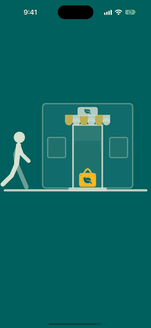&nbsp;
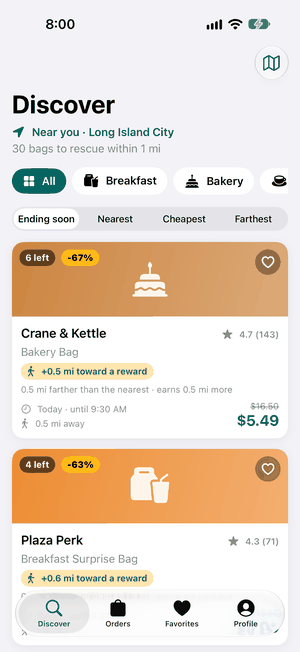&nbsp;
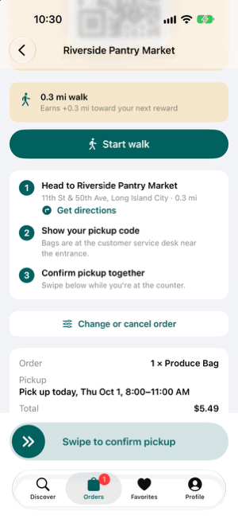

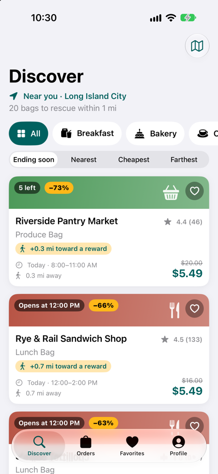&nbsp;
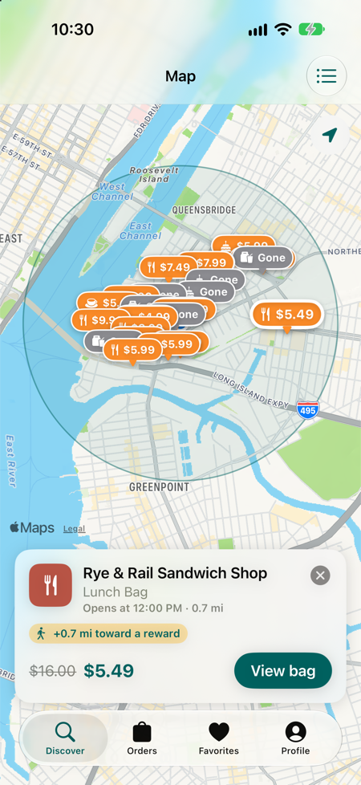&nbsp;
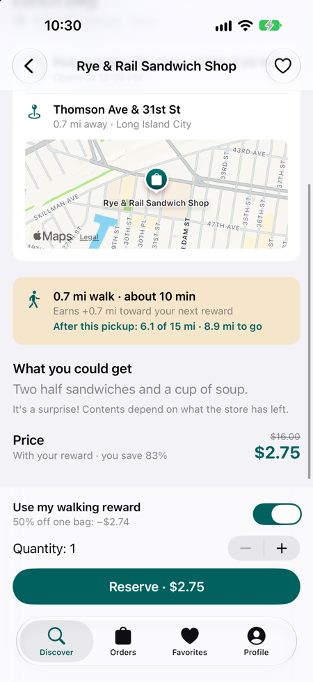&nbsp;
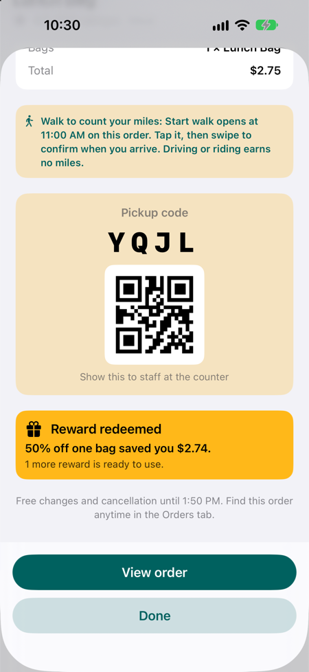

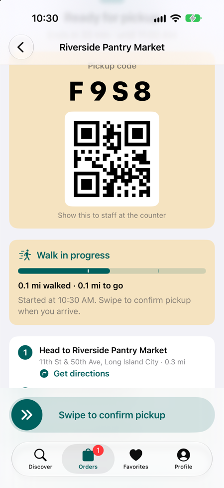&nbsp;
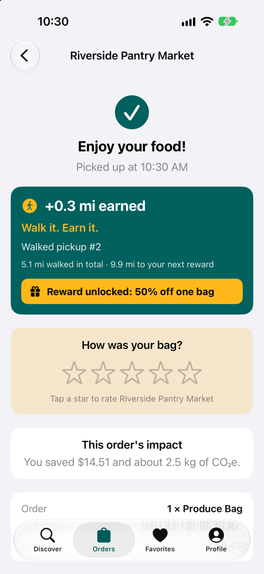&nbsp;
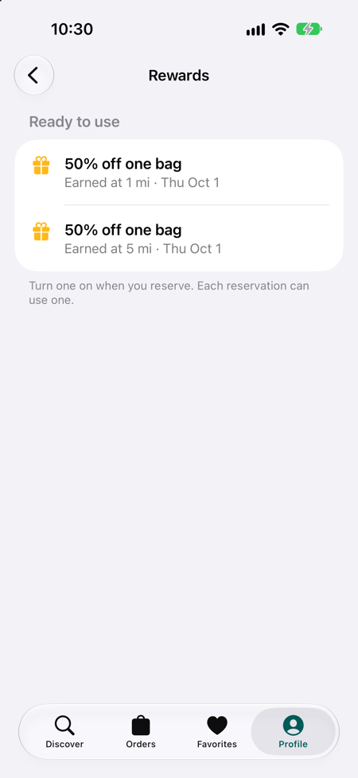&nbsp;
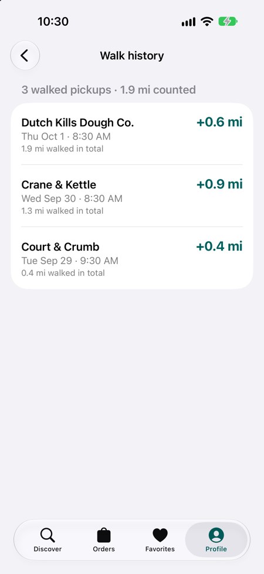

</div>

## Highlights

- **Real marketplace logic, fully on device.** Reservations are atomic inside a SwiftData actor. In a test,
  20 simultaneous reserve attempts on a bag with 4 left produce exactly 4 orders, never more.
- **Time zones handled correctly.** Business time always runs on New York time through an injected clock.
  Offers roll over daily, tomorrow's bags appear at 8 PM, and everything stays correct across midnight and
  daylight-saving changes.
- **Developer mode for demos.** A switch at the bottom of Profile, in every build, turns on a floating Demo menu:
  simulated walks you can step, pause or finish, time jumps to any pickup window, instant alerts and pickup
  reminders, and one-tap miles and rewards. Every screen otherwise looks exactly as customers see it.
- **Walk to earn.** Reserve a bag, tap Start walk, and walk to the pickup. GPS fixes are checked (speed, accuracy,
  simulated locations, where the walk ends) and up to 2 verified miles per pickup count toward rewards, which unlock at 1, 5 and 15 mi,
  then every 10 mi after that (25, 35, ...). Each reward is 50% off one bag. See the walking section of
  [ARCHITECTURE.md](ARCHITECTURE.md).
- **Modular architecture.** Five Swift Package modules with enforced dependency rules. Feature screens only see
  Domain protocols, and the whole app is assembled in one place.
- **Swift 6 strict concurrency with zero warnings.** Actors, `Sendable` value types, and no
  `@unchecked Sendable`.
- **412 automated tests.** 410 Swift Testing tests cover business rules, persistence, rollover, walk verification,
  Developer mode and every view model, plus 2 XCUITests for the reserve and reward flows. Every feature flag has its own test.
- **Polished details.** Dynamic Type, VoiceOver, dark mode, QR pickup codes, local notifications, MapKit
  browsing, and a location fallback when permission is denied.

## Architecture

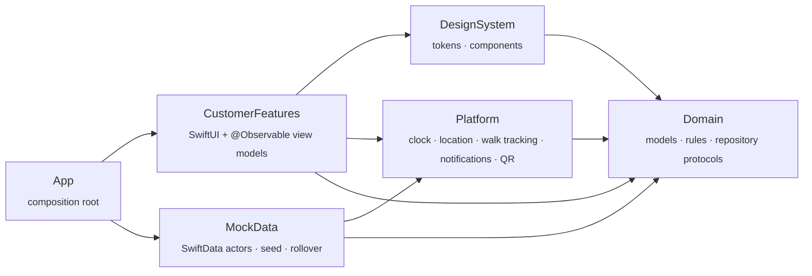

MVVM with one `@Observable` view model per screen. Views only render. Domain is pure Swift (Foundation only)
with no UI or persistence. See **[ARCHITECTURE.md](ARCHITECTURE.md)** for module rules, data flow, rollover and
flags.

| Area | Built with |
|---|---|
| UI | SwiftUI, MapKit, CoreImage (QR) |
| State | `@Observable` MVVM, `AsyncStream` change feeds |
| Persistence | SwiftData (two actors sharing one container) |
| Platform | CoreLocation (`CLLocationUpdate`, `CLServiceSession`, `CLBackgroundActivitySession`), UserNotifications |
| Quality | Swift Testing, XCUITest, `swift-format` |

About 13.1k lines of app code and 6.1k lines of tests.

## Run it

1. Open `Walk_And_Take.xcodeproj` in Xcode 27.
2. Pick the **Walk_And_Take** scheme and an iOS 26 or later simulator (we test on iPhone 18 Pro, iOS 27).
3. Press ⌘R to run and ⌘U to test.

<details>
<summary><b>Developer mode & demo tools</b></summary>

**Profile → Developer → Developer mode** works in every build (Debug and Release). Turning it on shows:

| Setting | What it does |
|---|---|
| Show demo controls | The floating **Demo** button on Discover, Offer Detail, Orders, an order, Favorites and Profile (on by default) |
| Fixed location | Pretend to be at the center of Long Island City, with no permission prompt |
| Simulated walks | Start walk follows a straight route from you to the store instead of GPS (on by default) |
| Auto-walk takes | How long a simulated walk takes to reach the door on its own: 10, 20 or 60 s |
| Time travel | Jump to breakfast, lunch, 8:15 PM (tomorrow's bags open), 11:50 PM or the next day, and back |
| Seed map | All 21 seed restaurants with the 1.5 mi service area |
| Clear walks & rewards | Back to zero miles and no rewards; orders stay |
| Reset demo data | Start the whole app over with fresh bags |

Turning Developer mode off puts every setting back to normal and the clock back to live time.

**The Demo button** lists only what makes sense on that screen:

| Screen | Actions |
|---|---|
| Discover | Jump to breakfast, lunch, tomorrow's bags or midnight; back to live time |
| Offer Detail | Jump to this bag's pickup time, or 5 min before it ends |
| Orders | A "your bag is ready" reminder for any active order, in 1 s |
| An order | Start walk now, +0.1 mi, pause or auto-walk, arrive now, send pickup reminder, confirm pickup now, open pickup now, jump to 5 min before it ends |
| Favorites | A store's "bags ready" alert in 1 s (or a sample alert with no favorites) |
| Profile | +0.5 mi, +1 mi, complete the next milestone, grant a reward |

A simple demo: reserve a bag, open the order, **Demo → Start walk now**, watch the bar fill (or **Arrive now**),
**Demo → Open pickup now**, swipe to confirm, then **Demo → Complete milestone** on Profile for the reward banner.

**Launch arguments** (debug builds only; the UI tests use the first four):

| Argument | Effect |
|---|---|
| `-UITestInMemoryStore` | Fresh in-memory data on every launch, with Developer mode off |
| `-UITestNow 2026-09-24T08:00:00-04:00` | Freezes the clock at that time |
| `-UITestFixedLocation` | Uses the LIC center as the device location |
| `-UITestSkipSplash` | Starts on the tabs |
| `-UITestSeedReward` | Start with one finished 1.2 mi walk and one banked 50% reward |
| `-UITestSeedMiles 4.7` | Start with one finished walk of that many miles (banks the milestones it reaches) |
| `-UITestSeedHistory` | Start with three finished walks at real restaurants (0.4, 0.9, 0.6 mi) |
| `-UITestSimulateWalk` | Every walk is simulated, even with Developer mode off |

The seed arguments can be combined, for example `-UITestSeedHistory -UITestSeedMiles 3.5` gives two banked rewards.

Run the tests from the terminal:

```sh
xcodebuild test -project Walk_And_Take.xcodeproj -scheme Walk_And_Take \
  -destination 'platform=iOS Simulator,name=iPhone 18 Pro'
```

</details>

## Team

Built by **Jian** and **Cheewai**. All restaurants and offers are fictional, set on real Long Island City
streets.
