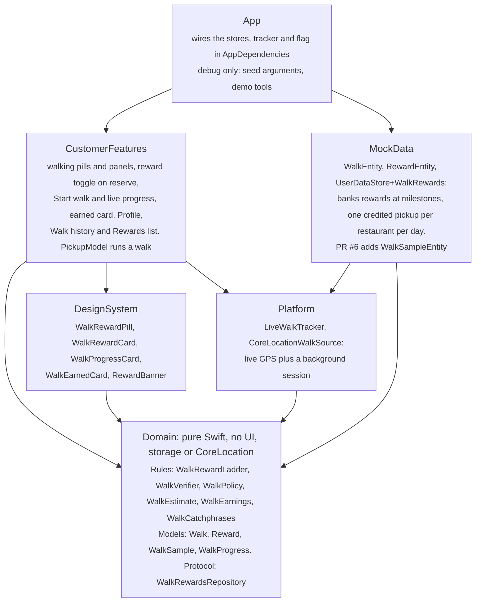
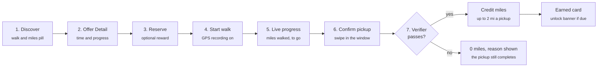

# Walk & Take walking rewards: build handoff

As of Oct 1, 2026. Written so a teammate, or a coding agent with none of the original conversation, can keep building.
A copy also lives as a shareable Claude doc; if the two ever differ, this file is the one that travels with the code.

## Status at a glance

Every PRD item (P0, P1, P2) is built, approved and merged to `main` through
[PR #4](https://github.com/JianTing-Li/walk-and-take/pull/4), merged Sep 30, 2026 by JianTing-Li.

| Item | Value |
| --- | --- |
| Merge | `main` at `4f18922` ("Merge pull request #4") |
| Source branch | `walk-and-take-app` (still on origin), cut from `4fb9d23` |
| Size | 18 commits, 92 files, +4,611 / −71 lines |
| Review | Approved. No CI checks were configured on the PR |
| Tests on `main` | 369 pass: 367 Swift Testing + 2 UI tests, on an iPhone 18 Pro (iOS 27) simulator |
| Follow-up in review | [PR #6](https://github.com/JianTing-Li/walk-and-take/pull/6) (`walk-rewards-next-steps`): reward spent atomically with its reservation, and GPS fixes saved across a kill. It sits on the 10 commits of PR #5, which was closed without merging |
| Tests on PR #6 | 442 pass: 440 Swift Testing + 2 UI tests |
| Not verified | A real walk on a physical device (including screen locked) and a real kill and relaunch mid-walk |

## What was built

The work followed the PRD's priorities: P0 (must-have) first, then P1, then P2, with a check-in and a simulator run
after each step. Each row below is one commit.

| Step | What it added | Commit |
| --- | --- | --- |
| P0.1 | Domain rules and models: reward ladder, walk verifier, start-window policy, walk-time estimate, `Walk` and `Reward` | `460ddb4` |
| P0.2 | Storage for walks and rewards, repository, reset wiring, the `walkRewards` flag | `32cf822` |
| P0.3 | Walking distance and reward miles on Discover cards, the map card and Offer Detail | `f1063b5` |
| P0.4 | Using a reward when reserving: 50% off one bag, discount shown before confirming | `f8a9e0a` |
| P0.5 | Walk tracking: Start walk, GPS recording with background location, completion on the swipe | `607ecac` |
| P0.6 | Profile: lifetime miles, miles to the next reward, rewards ready to use | `fa0a213` |
| P1.1 | Compare walks on Discover; progress after this pickup on Offer Detail | `d0c2cf0` |
| P1.2 | "Walk to qualify" reminders on the reserve bar and the confirmation sheet | `32bef15` |
| P1.3 | Live progress while walking | `ccd8280` |
| P1.4 | Miles-earned card with a rotating catchphrase and a reward-unlocked banner | `a68510d` |
| P1.5 | Reward-redeemed message; whole reward row made tappable (bug fix) | `505dab0` |
| Extra | Reward banner animation: pop, glow, confetti, haptic | `79995af` |
| Extra | Confetti made 20% bigger | `1c4de09` |
| P2.1 | Farthest sort on Discover | `c8e60f0` |
| P2.2 | Estimated walking time on Offer Detail | `00f70d1` |
| P2.3 | Walk history screen on Profile | `08103de` |
| P2.4 | Rewards list on Profile (ready and used) | `791dd23` |
| Docs | README, ARCHITECTURE.md section 9, new screenshots and GIFs | `02b19fa` |

On open PR #6, not yet on `main`:

| Step | What it adds | Commit |
| --- | --- | --- |
| Atomic rewards | A reward is spent in the same save as its reservation and given back in the same save as a cancellation; new `rewardUnavailable` error; both stores share one change feed | `6dedc3b` |
| Saved GPS fixes | Fixes are saved to disk in batches; a killed walk resumes with them, and a walk confirmed but not yet credited is finished from them | `6dedc3b` |
| Developer mode and polish | The 10 commits of PR #5, closed unmerged: Developer mode and a Demo menu, fixes (stuck swipe, double Start walk), tighter layout, recaptured screenshots | `b48058c` (branch tip) |

## Decisions already made

The PRD left several rules open, so they were settled one by one during the build. Rows marked *Builder default* were
never asked about and are open to change.

| Topic | Decision | Who decided |
| --- | --- | --- |
| Reward milestones | 1, 5 and 15 lifetime miles, then every 10 (25, 35, ...) | Team |
| Reward value | 50% off one bag. Banks without limit, never expires, one per reservation. Lifetime miles never reset | Team |
| Per-pickup cap | At most 2 credited miles per pickup | Team |
| Eligibility and time | Every offer is eligible, with no minimum distance. Time shown is 15 min per mile, an estimate only | Team |
| Start walk | Appears 1 h before the pickup window opens and disappears when it closes. No walk started means the pickup works but earns no miles | Team |
| Tracking | Live GPS with background tracking on the When In Use permission | Team |
| Anti-cheat | GPS only (details below). A pedometer / Core Motion check was deferred: it needs another permission prompt and can't be tried in the simulator | Team |
| Failed walk | The pickup still completes, earns 0 miles, and shows the reason | Team |
| Repeat pickups | One credited pickup per restaurant per calendar day, in the customer's current time zone (not New York) | Team |
| Completion | The existing swipe to confirm. No scanner, no proximity check | Team |
| Catchphrases | All ten PRD lines, one per credited pickup in order. The first is "Walk&Take: every mile gets you something." | Team |
| Sorting | "Farthest" added as a fourth sort next to Nearest; hidden when the flag is off | Team |
| Cancelled order that used a reward | The reward goes back to the bank | Builder default |
| Discount rounding | Rounds down to the cent: a $5.49 bag gets $2.74 off and costs $2.75 | Builder default |
| Walk history | Lists every finished walk, including ones that earned nothing, with the reason | Builder default |

The anti-cheat checks, all in `WalkVerifier`: segments faster than 5 mph are dropped; the whole walk is rejected if more
than 20% of the distance was too fast; fixes worse than 50 m accuracy are ignored; simulated fixes are rejected; the
walk must end within 100 m of the restaurant; credit is capped at 1.25 times the straight-line distance and at 2 miles.

Added on PR #6, as builder's choices that are open to change: a reward is spent in the same save as its reservation and
given back in the same save as a cancellation, and a refused reservation leaves the reward unspent. GPS fixes are saved
after every 5 fixes or 5 s of walking and when the walk ends, and are removed once the walk is credited or the order is
cancelled or missed.

## How the code is organised

Walking rewards touch every module, but the rules stay in `Domain` so they can be tested without a device.



Arrows point from a module to the one it depends on. **`CustomerFeatures` never imports `MockData`**: it only sees
`Domain` protocols, and the app target is the only place that knows the concrete stores exist. One flag,
`walkRewards`, hides every walking entry point while the data stays.

## How a walk flows end to end

Seven steps, with one branch: the verifier decides whether a walk earns miles.



The pickup is confirmed first and the recorded track is checked afterwards, so a failed check never blocks the food.
`PickupModel` runs steps 4 to 7 and `WalkVerifier.verify` is the check. A credited walk adds to lifetime miles, and
crossing a milestone (1, 5, 15, then every 10) banks a reward and shows the unlock banner. Start walk is available from
1 h before the pickup window until it closes.

## Run it and test it

Open `Walk_And_Take.xcodeproj` in Xcode, pick the **Walk_And_Take** scheme, press ⌘R to run and ⌘U to test. The scheme
runs the five package test targets and the UI tests together.

```sh
xcodebuild test -project Walk_And_Take.xcodeproj -scheme Walk_And_Take \
  -destination 'platform=iOS Simulator,name=iPhone 18 Pro'
```

For a faster loop, run only the package tests from `Packages/WalkAndTakeKit` with the `WalkAndTakeKit-Package` scheme.

**Simulator name.** The README and ARCHITECTURE.md still say iPhone 17 Pro, iOS 26.5, which was not installed on the
build machine. Every run in this build used an iPhone 18 Pro (iOS 27). Use any installed iPhone simulator and fix the
docs.

**Debug launch arguments** (debug builds only). The first four existed before this work; the rest drive the walking
demos.

| Argument | Effect |
| --- | --- |
| `-UITestInMemoryStore` | Fresh in-memory data on every launch |
| `-UITestNow 2026-09-24T08:00:00-04:00` | Freezes the clock (8 AM, so breakfast bags are open) |
| `-UITestFixedLocation` | Uses the LIC center, no permission prompt |
| `-UITestSkipSplash` | Starts on the tabs |
| `-UITestSeedReward` | One finished 1.2 mi walk, so one reward is banked |
| `-UITestSeedMiles 4.7` | One finished walk of that many miles; banks any milestones it reaches |
| `-UITestSeedHistory` | Three finished walks at real restaurants (0.4, 0.9, 0.6 mi) |
| `-UITestSimulateWalk` | Walks are simulated instead of GPS: a scripted 0.5 mi stroll of about 24 s on `main`; Developer mode's auto-walk to the door on PR #6 |

The seed arguments combine: `-UITestSeedHistory -UITestSeedMiles 3.5` gives two banked rewards. To launch from the
terminal with arguments, use
`xcrun simctl launch --terminate-running-process <device id> org.pursuit.Walk-And-Take <arguments>`.

PR #5, included in PR #6, adds a Developer mode (Profile > Developer, in every build; ARCHITECTURE.md section 10 on that
branch). On that branch `-UITestSimulateWalk` makes every walk one of its simulated walks, and Time travel and Seed map
moved into it.

**Test counts.** On `main`: 367 Swift Testing tests (Domain 95, Platform 30, MockData 54, DesignSystem 6,
CustomerFeatures 182) plus 2 UI tests, `ReserveHappyPathUITests` and `WalkRewardsUITests`. On PR #6: 440 (Domain 95,
Platform 56, MockData 73, DesignSystem 11, CustomerFeatures 205) plus the same 2 UI tests.

## Working rules and gotchas

These cost time during the build. Read them before changing the walking code.

- **Module boundary.** `CustomerFeatures` never imports `MockData`. Features use the repository protocols in `Domain`,
  and only the app target knows the concrete stores. `Domain` is Foundation-only, which is why a GPS fix is a plain
  `WalkSample` there, not a `CLLocation`.
- **Format every change** with `swift format --in-place <files>` (4 spaces, 120 columns, config in `.swift-format`).
- **Adding a `FeatureFlags` field** touches the struct and its init, `App/FeatureFlags+Default.swift`, the `@Entry`
  fallback in `FeatureFlags+Environment.swift`, the preview in `CustomerTabView.swift`, and every positional
  `FeatureFlags(...)` call in tests, including `Fixture.flags(...)` in `Fakes.swift`.
- **Adding a `CustomerDependencies` member** touches the struct, `AppDependencies.swift`, and the test `Harness` in
  `Fakes.swift`. This happened for both `walkRewards` and `walkTracker`.
- **New SwiftData fields on existing entities** must be optional or have a default. There is no migration plan, so the
  change relies on lightweight migration (`rewardID` and `discountCents` on `ReservationEntity`).
- **Keep debug-only code inside `#if DEBUG`:** the seed arguments and `LaunchOptions`. One helper landed outside the
  block once and had to be moved.
- **One save for the reward and the reservation (PR #6).** `MarketplaceStore.reserve` and `cancel` write the
  `RewardEntity` themselves, in the same save as the reservation, so a reward is never spent without an order. Do not
  call `redeemReward` or `releaseReward` on the reserve or cancel path. Both stores share one
  `Broadcaster<UserDataChange>` created in `AppDependencies`; build them the same way in tests (`TestEnv.makeStores`
  does).
- **Finishing a walk keeps its saved fixes (PR #6).** `WalkTracking.finish` returns the fixes but leaves the saved copy.
  Call `discard` once the walk is credited. `recover` reads saved fixes without starting to record.
- **Test clock and distances.** Unit tests treat Thu Sep 24, 2026 as today. Fixture restaurants sit 0.23 mi (Near
  Café), 0.60 mi (Mid Deli) and 2.10 mi (Far Bistro) from the LIC center. Compute distances; two early tests failed
  because the comments in the fixtures were wrong.
- **A SwiftUI `Toggle` label did not toggle.** In the live app only the small switch responded. The reward row now has
  `contentShape(Rectangle())` and a tap gesture, and a UI test taps both the row and the switch.
- **Trust UI tests over screenshots.** Simulator screenshots taken through a tool can lag one action behind taps, which
  made a working screen look broken. Use XCUITest to check sequences.
- **Status bar for docs images.** `xcrun simctl status_bar <device> override --time` needs a full ISO time with
  milliseconds: `2026-09-24T12:00:00.000Z` shows 8:00 AM in New York. Clear it with `status_bar <device> clear`.
- **`xcodebuild test` can finish its tests and not exit.** The results print, then the process lingers. Read the
  results and stop it.

## Known limits and open risks

The biggest gap is that the real GPS tracker has never run on a device. The list below is what the build's own review
turned up; the killed-app and reward-claim rows are fixed on PR #6 (open) and the rest are untouched.

| Risk | What it means |
| --- | --- |
| Real GPS untested | Only simulated walks (`-UITestSimulateWalk`, and Developer mode on PR #6) have run. The real `CoreLocation` tracker, tracking with the screen locked, and iOS's simulated-location flag have not been tried on a device. The simulator's own location may be flagged as simulated and rejected. |
| App killed mid-walk | Fixed on PR #6: fixes are saved to disk in batches and the walk resumes with them. Not yet tried with a real kill and relaunch. |
| Reward claim gap | Fixed on PR #6: the reward is spent in the same save as the reservation, and given back in the same save as a cancellation. |
| Live count vs final check | "Counting +x mi so far" drops fast segments but does not judge the whole walk. A walk can show miles live and still be rejected at pickup, for example if it ends far from the restaurant. |
| Anti-cheat limits | Speed above 5 mph is caught. A phone carried by someone else, a changed device clock or a determined spoofer is not. Everything runs on device with no server. |
| Crowded reserve bar | The walk line, reminder, reward row, quantity stepper and button stack on one bar and cover much of a small screen. Large text sizes were not checked on the screens. |
| Silent cancel | Cancelling an order that used a reward returns it with no message to the customer. |
| Profile spacing | The Rewards and Walk history rows sit directly under the teal Walking rewards card with no gap. |
| Stale docs | `docs/screenshots/map.png` predates the walking pill. The docs name a simulator that was not installed. |
| Narrow test environment | Everything ran on one simulator (iPhone 18 Pro, iOS 27). Screens were checked in light mode at default text size; components have light, dark and large-text render tests. |
| Upgrade path (PR #6) | `WalkSampleEntity` is a new table and relies on SwiftData's automatic migration. Not tested against an existing install. |
| Developer mode in every build (PR #5) | PR #5, included in PR #6, makes Developer mode available in release builds, so a demo menu would reach customers unless that is changed. |

## Suggested next steps

Walk on a real device first; what it shows decides how much of the rest is needed. Start new work on a fresh branch from
`main`, since `walk-and-take-app` is merged.

1. **Device walk test.** Reserve a bag, tap Start walk, lock the phone, walk to the pickup, then swipe to confirm. Check
   that real GPS is credited and is not rejected as simulated, and that tracking survives the locked screen. Also kill
   the app mid-walk and reopen the order to see the walk resume with its saved fixes.
2. **Decide on a motion check.** A pedometer / Core Motion cross-check would catch rides that stay under 5 mph, at the
   cost of another permission prompt. Decide before real discounts depend on the miles.
3. **Say so when a cancel returns a reward.** PR #5's description says it adds this message; confirm once it merges.
4. **Tidy the layout.** Slim the reserve bar, add spacing between the Profile rows and the Walking rewards card, and
   check the screens at large text sizes. PR #5 tightens the layout, so recheck after it merges.
5. **Fix the docs.** Recapture `map.png` with the walking pill, and replace the simulator name in the README and
   ARCHITECTURE.md with one that exists.
6. **Decide what to do about Developer mode in release builds** before PR #5's work ships.

Already done on PR #6 (open): keeping GPS fixes across a kill, and spending a reward in the same save as its
reservation. Try the kill and relaunch before merging it.

## Where things are

The repo is [JianTing-Li/walk-and-take](https://github.com/JianTing-Li/walk-and-take) and the merged change is
[PR #4](https://github.com/JianTing-Li/walk-and-take/pull/4). Paths below start at
`Packages/WalkAndTakeKit/Sources/` unless they begin with `App`, `docs` or `WalkAndTakeUITests`.

| Area | Files |
| --- | --- |
| Rules | `Domain/Rules/`: `WalkRewardLadder`, `WalkVerifier`, `WalkPolicy`, `WalkEstimate`, `WalkEarnings`, `WalkCatchphrases` |
| Models and repository | `Domain/Models/Walk.swift` (`Walk`, `Reward`, `WalkSample`, `WalkProgress`), `Domain/Repositories/WalkRewardsRepository.swift`, and `rewardID` / `discount` on `Reservation.swift` |
| GPS tracking | `Platform/Location/WalkTracking.swift` (`LiveWalkTracker`), `Platform/Location/CoreLocationWalkSource.swift` |
| Storage | `MockData/Persistence/WalkEntity.swift`, `RewardEntity.swift`, `MockData/UserDataStore+WalkRewards.swift`, `MarketplaceStore+Reservations.swift` (discount on reserve) |
| UI components | `DesignSystem/Components/`: `WalkRewardPill`, `WalkRewardCard`, `WalkProgressCard`, `WalkEarnedCard`, `RewardBanner` |
| Screens | `CustomerFeatures/Walking/` (`WalkCopy`, walk history, rewards list), plus the walking parts of `Orders/Pickup/PickupModel.swift`, `Reserve/ReserveModel.swift`, `OfferDetail/OfferDetailModel.swift`, `Discover/OfferCatalog.swift`, `Profile/ProfileModel.swift` |
| App wiring and debug | `App/AppDependencies.swift`, `App/Debug/LaunchOptions.swift` |
| Background location | `UIBackgroundModes` = `location` in `App/Resources/Info.plist`; the location usage text is in `Walk_And_Take.xcodeproj/project.pbxproj` |
| Tests | `Packages/WalkAndTakeKit/Tests/`: `DomainTests/WalkTests.swift`, `PlatformTests/WalkTrackerTests.swift`, `MockDataTests/WalkRewardsStoreTests.swift`, `CustomerFeaturesTests/` (walk history, rewards list, copy, pickup, profile, offer detail); UI: `WalkAndTakeUITests/WalkRewardsUITests.swift` |
| Docs | `ARCHITECTURE.md` (section 9, "Walking rewards"), `README.md`, `docs/screenshots/`, this file |

Added on PR #6 (these files exist only on that branch until it merges; paths start the same way):

| Area | Files |
| --- | --- |
| Atomic rewards | `MockData/MarketplaceStore+Reservations.swift` (claim in `reserve`, release in `cancel`), `MockData/MarketplaceStore.swift` (the shared `rewardChanges` feed), `Domain/Rules/ReservationError.swift` (`rewardUnavailable`), `Domain/Repositories/ReservationRepository.swift` (the contract) |
| Saved GPS fixes | `Domain/Repositories/WalkSampleStoring.swift`, `MockData/Persistence/WalkSampleEntity.swift`, `MockData/UserDataStore+WalkRewards.swift` (storage), `Platform/Location/WalkTracking.swift` (`LiveWalkTracker` batching, `recover`, `discard`), `CustomerFeatures/Orders/Pickup/PickupModel.swift` (finishing an interrupted walk) |
| Tests | `Packages/WalkAndTakeKit/Tests/`: `MockDataTests/RewardAtomicityTests.swift`, `MockDataTests/WalkSampleStoreTests.swift`, `PlatformTests/WalkTrackerPersistenceTests.swift`, and new cases in `CustomerFeaturesTests/PickupAndManageTests.swift` |
